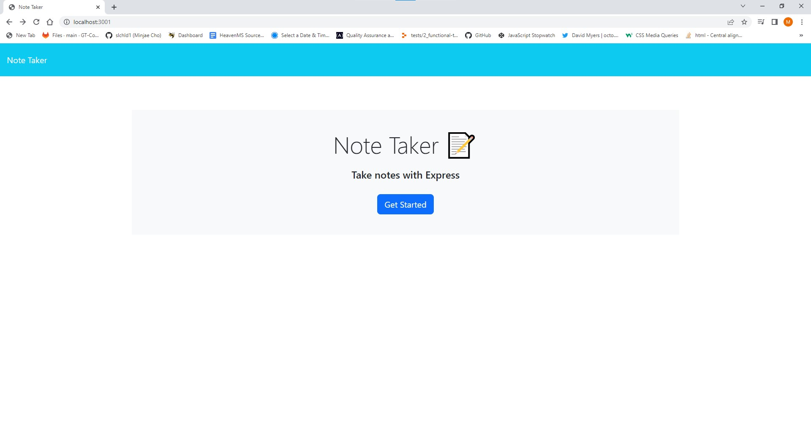
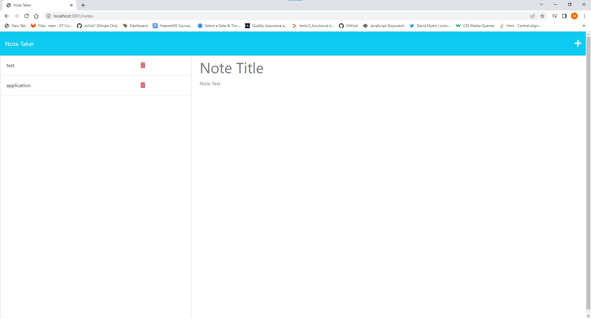

<h1 align="center">Note Taker Express 🚝</h1>

    
    
    
    

## Description 💾
Note Taker Express is an application created with `Express` used to save notes.

Every note is created with a specific id using `nanoid`. The application lets you to stay neatly organized tasks to help you complete them in an orderly fashion. Once you complete the task you could use the delete button to remove the note.
## User Story ✉️
~~~
AS A small business owner
I WANT to be able to write and save notes
SO THAT I can organize my thoughts and keep track of tasks I need to complete
~~~
## Acceptance Criteria 📩
~~~
GIVEN a note-taking application
WHEN I open the Note Taker
THEN I am presented with a landing page with a link to a notes page
WHEN I click on the link to the notes page
THEN I am presented with a page with existing notes listed in the left-hand column, plus empty fields to enter a new note title and the note’s text in the right-hand column
WHEN I enter a new note title and the note’s text
THEN a Save icon appears in the navigation at the top of the page
WHEN I click on the Save icon
THEN the new note I have entered is saved and appears in the left-hand column with the other existing notes
WHEN I click on an existing note in the list in the left-hand column
THEN that note appears in the right-hand column
WHEN I click on the Write icon in the navigation at the top of the page
THEN I am presented with empty fields to enter a new note title and the note’s text in the right-hand column
~~~
## Table of Contents 🔍
* [Installation](#installation-)
* [Usage](#usage-)
* [Questions](#questions-)
* [License](#license-)
## Installation 🔨
To use this application direct to the git repo, `git clone` the repo down to your local.

Run `npm install` or `npm i` in order to install the following npm package,

Make sure you follow the correct version listed in the dependencies of `package.json` file.

* [`Express`](https://www.npmjs.com/package/express) 
* [`Nanoid`](https://www.npmjs.com/package/nanoid)
* [`Node.js`](https://nodejs.org/en/) Node.js is required for this application 

In order to start the application, direct your terminal to the same folder as where server.js is located,

then type `node server` in the command line to start your server into <a href=http://localhost:3001/>`http://localhost:3001/`</a>.

## Usage 💡

Application is run on <a href=http://localhost:3001/>`http://localhost:3001/`</a>. Press get started to access application.

Notes can be added on the right side of the page, once `Note title` and `note text` is filled, you can access the save button to save your note.

Saved notes can be accessed on the left side of the page, notes can be edited by clicking on the note on the left side.

Notes can also be deleted with the red trashcan icon. 

## License
MIT License

## Questions ❓

For any Additional questions, Please reach out to: jaecho203@gmail.com

Or visit slchld1 on github! Thank you.

